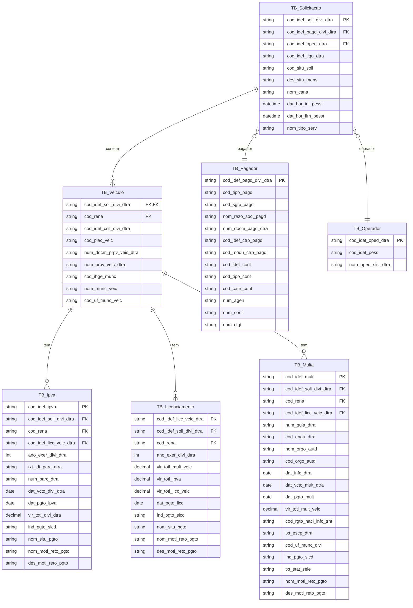

# README — Esquema (DDL) + Entidades JPA do **Gestão de Dívidas**

Este README reúne **o script SQL completo** (DDL) e as **classes Java/JPA** equivalentes, explicando:
- o que faz **cada comando do script** (DROP/CREATE/INDEX/ALTER/FOREIGN KEY);
- o que faz **cada anotação** nas entidades (JPA, Bean Validation e Lombok);
- todo o **relacionamento** entre as tabelas/entidades, com **diagrama visual**.

> Banco-alvo: **Aurora MySQL** (compatível com MySQL).  
> Convenções de tipos: `varchar`→`String`, `char(1)`→`String`, `smallint`→`Integer`, `date`→`LocalDate`, `datetime`→`LocalDateTime`, `decimal(17,2)`→`BigDecimal`.

---

## Visão geral (ERD)



---

## Script DDL — **conteúdo completo** + explicações

> **Como ler**: abaixo está o script consolidado (com base nas capturas).  
> Após cada bloco, explico o que o comando faz.

```sql
-- RITM5994698
-- qtxrmx0c 06.10.2025

/* 1) desligamos checagem de FK para permitir drop e recriação em ordem livre */
set foreign_key_checks = 0;

/* 2) limpeza idempotente (só dropa se existir) */
drop table if exists tbepp915_filt_soli_divi_dtra;
drop table if exists tbepp916_ipva_dtra;
drop table if exists tbepp917_licc_veic_dtra;
drop table if exists tbepp918_mult_dtra;
drop table if exists tbepp919_oped_sist_dtra;
drop table if exists tbepp920_pagd_divi_dtra;
drop table if exists tbepp921_soli_divi_dtra;
drop table if exists tbepp922_veic_dtra;

/* 3) reativamos checagem de FK para a criação */
set foreign_key_checks = 1;

/* 4) filtro auxiliar de consulta */
create table tbepp915_filt_soli_divi_dtra (
  cod_soli                 varchar(36) not null,
  cod_uf_munc_veic        varchar(50),
  ano_exer_divi_dtra      smallint,
  cod_parc_dtra           varchar(20),
  cod_rena                varchar(12),
  cod_digt_fina_plac_veic tinyint,
  primary key (cod_soli)
);

/* 5) tabela IPVA (divida) */
create table tbepp916_ipva_dtra (
  cod_idef_ipva            varchar(36) not null,
  cod_idef_soli_divi_dtra  varchar(36) not null,
  cod_rena                 varchar(12) not null,
  cod_idef_licc_veic_dtra  varchar(36),
  ano_exer_divi_dtra       smallint not null,
  txt_idt_parc_dtra        varchar(20),
  num_parc_dtra            varchar(3) not null,
  dat_vcto_divi_dtra       date not null,
  vlr_totl_divi_dtra       decimal(17,2),
  ind_pgto_slcd            char(1) not null,
  nom_situ_pgto            varchar(10),
  nom_moti_reto_pgto       varchar(20),
  des_moti_reto_pgto       varchar(30),
  primary key (cod_idef_ipva)
);

/* índices auxiliares de IPVA */
create index xepp9162 on tbepp916_ipva_dtra (cod_idef_soli_divi_dtra, cod_rena);
create index xepp9163 on tbepp916_ipva_dtra (cod_idef_licc_veic_dtra);

/* 6) licenciamento agregado por veículo */
create table tbepp917_licc_veic_dtra (
  cod_idef_licc_veic_dtra  varchar(36) not null,
  cod_idef_soli_divi_dtra  varchar(36) not null,
  cod_rena                 varchar(12) not null,
  ano_exer_divi_dtra       smallint not null,
  vlr_totl_mult_veic       decimal(17,2),
  vlr_totl_ipva            decimal(17,2),
  vlr_totl_licc_veic       decimal(17,2) not null,
  ind_pgto_slcd            char(1) not null,
  nom_situ_pgto            varchar(10),
  nom_moti_reto_pgto       varchar(20),
  des_moti_reto_pgto       varchar(30),
  primary key (cod_idef_licc_veic_dtra)
);

/* índice para buscar licenciamento por (solicitação, renavam) */
create index xepp9172 on tbepp917_licc_veic_dtra (cod_idef_soli_divi_dtra, cod_rena);

/* 7) multas */
create table tbepp918_mult_dtra (
  cod_idef_mult            varchar(36) not null,
  cod_idef_soli_divi_dtra  varchar(36) not null,
  cod_rena                 varchar(12) not null,
  cod_idef_licc_veic_dtra  varchar(36),
  num_guia_dtra            varchar(30) not null,
  cod_engu_dtra            varchar(30) not null,
  nom_orgo_autd            varchar(50),
  cod_orgo_autd            varchar(10),
  dat_infc_dtra            date not null,
  dat_vcto_mult_dtra       date not null,
  vlr_totl_mult_veic       decimal(17,2) not null,
  cod_rgto_naci_infc_trnt  char(1),
  txt_escp_dtra            varchar(256),
  cod_uf_munc_divi         varchar(50),
  ind_pgto_slcd            char(1) not null,
  txt_stat_sele            varchar(10),
  nom_moti_reto_pgto       varchar(20),
  des_moti_reto_pgto       varchar(30),
  primary key (cod_idef_mult)
);

/* índices em multa */
create index xepp9182 on tbepp918_mult_dtra (cod_idef_licc_veic_dtra);
create index xepp9183 on tbepp918_mult_dtra (cod_idef_soli_divi_dtra, cod_rena);

/* 8) operador de sistema */
create table tbepp919_oped_sist_dtra (
  cod_idef_oped_dtra varchar(9)  not null,
  cod_idef_pess      varchar(36),
  nom_oped_sist_dtra varchar(80) not null,
  primary key (cod_idef_oped_dtra)
);

/* 9) pagador */
create table tbepp920_pagd_divi_dtra (
  cod_idef_pagd_divi_dtra varchar(36) not null,
  cod_tipo_pagd           varchar(2)  not null,
  cod_sgtp_pagd           varchar(12),
  nom_razo_soci_pagd      varchar(120),
  num_docm_pagd_dtra      varchar(15) not null,
  cod_idef_ctrp_pagd      varchar(36) not null,
  cod_modu_ctrp_pagd      varchar(250),
  cod_idef_cont           varchar(36),
  cod_tipo_cont           varchar(10) not null,
  cod_cate_cont           varchar(2),
  num_agen                varchar(4)  not null,
  num_cont                varchar(7)  not null,
  num_digt                varchar(2)  not null,
  primary key (cod_idef_pagd_divi_dtra)
);

/* 10) solicitação de dívida (cabeçalho) */
create table tbepp921_soli_divi_dtra (
  cod_idef_soli_divi_dtra varchar(36) not null,
  cod_idef_liqu_dtra      varchar(36) not null,
  cod_situ_soli           varchar(25) not null,
  des_situ_mens           varchar(256),
  cod_idef_pagd_divi_dtra varchar(36) not null,
  cod_idef_oped_dtra      varchar(9)  not null,
  nom_cana                varchar(20) not null,
  dat_hor_ini_pesst       datetime    not null,
  dat_hor_fim_pesst       datetime,
  nom_tipo_serv           varchar(20) not null,
  primary key (cod_idef_soli_divi_dtra)
);

/* índices da solicitação (para FKs) */
create index xepp9212 on tbepp921_soli_divi_dtra (cod_idef_oped_dtra);
create index xepp9213 on tbepp921_soli_divi_dtra (cod_idef_pagd_divi_dtra);
create index xepp9214 on tbepp921_soli_divi_dtra (cod_idef_liqu_dtra);

/* 11) veículo (PK composta) */
create table tbepp922_veic_dtra (
  cod_idef_soli_divi_dtra varchar(36) not null,
  cod_rena                varchar(12) not null,
  cod_idef_csit_divi_dtra varchar(36) not null,
  cod_plac_veic           varchar(10) not null,
  num_docm_prpv_veic_dtra varchar(15) not null,
  nom_prpv_veic_dtra      varchar(80),
  cod_ibge_munc           varchar(10),
  nom_munc_veic           varchar(50),
  cod_uf_munc_veic        varchar(50),
  primary key (cod_idef_soli_divi_dtra, cod_rena)
);

/* índice para buscar todos os veículos pela solicitação */
create index xepp9222 on tbepp922_veic_dtra (cod_idef_soli_divi_dtra);

/* 12) FOREIGN KEYS (integridade referencial) */
alter table tbepp916_ipva_dtra
  add constraint fep9161_tbepp917 foreign key (cod_idef_licc_veic_dtra)
    references tbepp917_licc_veic_dtra (cod_idef_licc_veic_dtra);

alter table tbepp916_ipva_dtra
  add constraint fep9162_tbepp922 foreign key (cod_idef_soli_divi_dtra, cod_rena)
    references tbepp922_veic_dtra (cod_idef_soli_divi_dtra, cod_rena);

alter table tbepp917_licc_veic_dtra
  add constraint fep9171_tbepp922 foreign key (cod_idef_soli_divi_dtra, cod_rena)
    references tbepp922_veic_dtra (cod_idef_soli_divi_dtra, cod_rena);

alter table tbepp918_mult_dtra
  add constraint fep9181_tbepp917 foreign key (cod_idef_licc_veic_dtra)
    references tbepp917_licc_veic_dtra (cod_idef_licc_veic_dtra);

alter table tbepp918_mult_dtra
  add constraint fep9182_tbepp922 foreign key (cod_idef_soli_divi_dtra, cod_rena)
    references tbepp922_veic_dtra (cod_idef_soli_divi_dtra, cod_rena);

alter table tbepp921_soli_divi_dtra
  add constraint fep9211_tbepp920 foreign key (cod_idef_pagd_divi_dtra)
    references tbepp920_pagd_divi_dtra (cod_idef_pagd_divi_dtra);

alter table tbepp921_soli_divi_dtra
  add constraint fep9212_tbepp919 foreign key (cod_idef_oped_dtra)
    references tbepp919_oped_sist_dtra (cod_idef_oped_dtra);

alter table tbepp922_veic_dtra
  add constraint fep9221_tbepp921 foreign key (cod_idef_soli_divi_dtra)
    references tbepp921_soli_divi_dtra (cod_idef_soli_divi_dtra);

/* 13) complemento — inclusão de datas de pagamento (RITM6114708) */
alter table tbepp916_ipva_dtra add dat_pgto_ipva date;
alter table tbepp917_licc_veic_dtra add dat_pgto_licc date;
alter table tbepp918_mult_dtra add dat_pgto_mult date;
```

### O que cada comando faz (resumo)
- `set foreign_key_checks = 0/1`: desliga/religa a verificação de FKs para permitir recriar tabelas fora da ordem de dependência.  
- `drop table if exists ...`: remove a tabela caso exista (idempotente).  
- `create table ...`: cria a tabela e suas colunas/tipos; `primary key` define a chave primária (pode ser **composta**).  
- `create index ... on ... (colunas)`: cria **índices** para acelerar filtros/joins nessas colunas.  
- `alter table ... add constraint ... foreign key (...) references ...`: cria a **FK** que garante integridade referencial entre tabelas.  
- `alter table ... add <coluna> <tipo>`: adiciona novas colunas (ex.: datas de pagamento).

---

## Código Java (Entidades JPA) — **conteúdo completo**

> Anotações em **Jakarta** (Spring Boot 3+). Se estiver em Boot 2, troque `jakarta.persistence` por `javax.persistence`.

### Conversor utilitário

```java
package br.com.itau.caps.sispag.gestao.dividas.domain.jpa;

import java.util.Locale;
import jakarta.persistence.AttributeConverter;
import jakarta.persistence.Converter;

@Converter(autoApply = false)
public class UpperTrimConverter implements AttributeConverter<String, String> {
  @Override public String convertToDatabaseColumn(String attribute) {
    return attribute == null ? null : attribute.trim().toUpperCase(Locale.ROOT);
  }
  @Override public String convertToEntityAttribute(String dbData) { return dbData; }
}
```

### `SoliDiviDtraEntity` (tbepp921_soli_divi_dtra)

```java
package br.com.itau.caps.sispag.gestao.dividas.domain.entity;

import java.io.Serializable;
import java.time.LocalDateTime;
import jakarta.persistence.*;
import jakarta.validation.constraints.*;
import lombok.*;

@Getter @Setter
@NoArgsConstructor(access = AccessLevel.PROTECTED) @AllArgsConstructor @Builder
@EqualsAndHashCode(onlyExplicitlyIncluded = true)
@ToString(onlyExplicitlyIncluded = true)
@Entity
@Table(name = "tbepp921_soli_divi_dtra",
       indexes = {
         @Index(name = "xepp9212", columnList = "cod_idef_oped_dtra"),
         @Index(name = "xepp9213", columnList = "cod_idef_pagd_divi_dtra"),
         @Index(name = "xepp9214", columnList = "cod_idef_liqu_dtra")
       })
public class SoliDiviDtraEntity implements Serializable {

  @Id
  @EqualsAndHashCode.Include @ToString.Include
  @Column(name = "cod_idef_soli_divi_dtra", nullable = false, length = 36)
  private String id;

  @NotBlank @Size(max = 36)
  @Column(name = "cod_idef_liqu_dtra", nullable = false, length = 36)
  private String codIdefLiquDtra;

  @NotBlank @Size(max = 25)
  @Column(name = "cod_situ_soli", nullable = false, length = 25)
  private String codSituSoli;

  @Size(max = 256)
  @Column(name = "des_situ_mens", length = 256)
  private String desSituMens;

  @ManyToOne(fetch = FetchType.LAZY, optional = false)
  @JoinColumn(name = "cod_idef_pagd_divi_dtra",
              foreignKey = @ForeignKey(name = "fep9211_tbepp920"))
  @ToString.Exclude
  private PagdDiviDtraEntity pagador;

  @ManyToOne(fetch = FetchType.LAZY, optional = false)
  @JoinColumn(name = "cod_idef_oped_dtra",
              foreignKey = @ForeignKey(name = "fep9212_tbepp919"))
  @ToString.Exclude
  private OpedSistDtraEntity operador;

  @NotBlank @Size(max = 20)
  @Column(name = "nom_cana", nullable = false, length = 20)
  private String nomCana;

  @NotNull
  @Column(name = "dat_hor_ini_pesst", nullable = false)
  private LocalDateTime datHorIniPesst;

  @Column(name = "dat_hor_fim_pesst")
  private LocalDateTime datHorFimPesst;

  @NotBlank @Size(max = 20)
  @Column(name = "nom_tipo_serv", nullable = false, length = 20)
  private String nomTipoServ;
}
```

### PK composta do veículo

```java
package br.com.itau.caps.sispag.gestao.dividas.domain.entity;

import java.io.Serializable;
import jakarta.persistence.*;
import jakarta.validation.constraints.*;
import lombok.*;

@Embeddable
@Getter @Setter @NoArgsConstructor @AllArgsConstructor
@EqualsAndHashCode
public class VeicDtraId implements Serializable {
  @NotBlank @Size(max = 36)
  @Column(name = "cod_idef_soli_divi_dtra", nullable = false, length = 36)
  private String codIdefSoliDiviDtra;

  @NotBlank @Size(max = 12)
  @Column(name = "cod_rena", nullable = false, length = 12)
  private String codRena;
}
```

### `VeicDtraEntity` (tbepp922_veic_dtra)

```java
package br.com.itau.caps.sispag.gestao.dividas.domain.entity;

import java.io.Serializable;
import jakarta.persistence.*;
import jakarta.validation.constraints.*;
import lombok.*;

@Getter @Setter
@NoArgsConstructor(access = AccessLevel.PROTECTED) @AllArgsConstructor @Builder
@EqualsAndHashCode(onlyExplicitlyIncluded = true)
@Entity
@Table(name = "tbepp922_veic_dtra",
       indexes = { @Index(name = "xepp9222", columnList = "cod_idef_soli_divi_dtra") })
public class VeicDtraEntity implements Serializable {

  @EmbeddedId
  @EqualsAndHashCode.Include
  private VeicDtraId id;

  @MapsId("codIdefSoliDiviDtra")
  @ManyToOne(fetch = FetchType.LAZY, optional = false)
  @JoinColumn(name = "cod_idef_soli_divi_dtra",
              foreignKey = @ForeignKey(name = "fep9221_tbepp921"))
  @ToString.Exclude
  private SoliDiviDtraEntity solicitacao;

  @NotBlank @Size(max = 36)
  @Column(name = "cod_idef_csit_divi_dtra", nullable = false, length = 36)
  private String codIdefCsitDiviDtra;

  @NotBlank @Size(max = 10)
  @Column(name = "cod_plac_veic", nullable = false, length = 10)
  private String codPlacVeic;

  @NotBlank @Size(max = 15)
  @Column(name = "num_docm_prpv_veic_dtra", nullable = false, length = 15)
  private String numDocmPrpvVeicDtra;

  @Size(max = 80)
  @Column(name = "nom_prpv_veic_dtra", length = 80)
  private String nomPrpvVeicDtra;

  @Size(max = 10)
  @Column(name = "cod_ibge_munc", length = 10)
  private String codIbgeMunc;

  @Size(max = 50)
  @Column(name = "nom_munc_veic", length = 50)
  private String nomMuncVeic;

  @Size(max = 50)
  @Column(name = "cod_uf_munc_veic", length = 50)
  private String codUfMuncVeic;

  public String getCodRena() { return id != null ? id.getCodRena() : null; }
  public String getCodIdefSoliDiviDtra() { return id != null ? id.getCodIdefSoliDiviDtra() : null; }
}
```

### `IpvaDtraEntity` (tbepp916_ipva_dtra)

```java
package br.com.itau.caps.sispag.gestao.dividas.domain.entity;

import java.io.Serializable;
import java.math.BigDecimal;
import java.time.LocalDate;
import jakarta.persistence.*;
import jakarta.validation.constraints.*;
import lombok.*;
import br.com.itau.caps.sispag.gestao.dividas.domain.jpa.UpperTrimConverter;

@Getter @Setter
@NoArgsConstructor(access = AccessLevel.PROTECTED) @AllArgsConstructor @Builder
@EqualsAndHashCode(onlyExplicitlyIncluded = true)
@Entity
@NamedEntityGraph(
  name = "Ipva.withRefs",
  attributeNodes = {
    @NamedAttributeNode("veiculo"),
    @NamedAttributeNode("licenciamentoVeiculo")
  }
)
@Table(name = "tbepp916_ipva_dtra",
       indexes = {
         @Index(name = "xepp9162", columnList = "cod_idef_soli_divi_dtra,cod_rena"),
         @Index(name = "xepp9163", columnList = "cod_idef_licc_veic_dtra")
       })
public class IpvaDtraEntity implements Serializable {

  @Id
  @EqualsAndHashCode.Include
  @Column(name = "cod_idef_ipva", nullable = false, length = 36)
  private String id;

  @ManyToOne(fetch = FetchType.LAZY, optional = false)
  @JoinColumns({
    @JoinColumn(name = "cod_idef_soli_divi_dtra", referencedColumnName = "cod_idef_soli_divi_dtra",
                foreignKey = @ForeignKey(name = "fep9162_tbepp922")),
    @JoinColumn(name = "cod_rena", referencedColumnName = "cod_rena",
                foreignKey = @ForeignKey(name = "fep9162_tbepp922"))
  })
  @ToString.Exclude
  private VeicDtraEntity veiculo;

  @ManyToOne(fetch = FetchType.LAZY)
  @JoinColumn(name = "cod_idef_licc_veic_dtra",
              foreignKey = @ForeignKey(name = "fep9161_tbepp917"))
  @ToString.Exclude
  private LiccVeicDtraEntity licenciamentoVeiculo;

  @NotNull
  @Column(name = "ano_exer_divi_dtra", nullable = false)
  private Integer anoExerDiviDtra;

  @Size(max = 20)
  @Column(name = "txt_idt_parc_dtra", length = 20)
  private String txtIdtParcDtra;

  @NotBlank @Size(max = 3)
  @Column(name = "num_parc_dtra", nullable = false, length = 3)
  private String numParcDtra;

  @NotNull
  @Column(name = "dat_vcto_divi_dtra", nullable = false)
  private LocalDate datVctoDiviDtra;

  @Column(name = "dat_pgto_ipva")
  private LocalDate datPgtoIpva;

  @Digits(integer = 15, fraction = 2)
  @Column(name = "vlr_totl_divi_dtra", precision = 17, scale = 2)
  private BigDecimal vlrTotlDiviDtra;

  @NotBlank @Size(max = 1)
  @Convert(converter = UpperTrimConverter.class)
  @Column(name = "ind_pgto_slcd", nullable = false, length = 1)
  private String indPgtoSlcd;

  @Size(max = 10)
  @Convert(converter = UpperTrimConverter.class)
  @Column(name = "nom_situ_pgto", length = 10)
  private String nomSituPgto;

  @Size(max = 20)
  @Column(name = "nom_moti_reto_pgto", length = 20)
  private String nomMotiRetoPgto;

  @Size(max = 30)
  @Column(name = "des_moti_reto_pgto", length = 30)
  private String desMotiRetoPgto;
}
```

### `LiccVeicDtraEntity` (tbepp917_licc_veic_dtra)

```java
package br.com.itau.caps.sispag.gestao.dividas.domain.entity;

import java.io.Serializable;
import java.math.BigDecimal;
import java.time.LocalDate;
import jakarta.persistence.*;
import jakarta.validation.constraints.*;
import lombok.*;
import br.com.itau.caps.sispag.gestao.dividas.domain.jpa.UpperTrimConverter;

@Getter @Setter
@NoArgsConstructor(access = AccessLevel.PROTECTED) @AllArgsConstructor @Builder
@EqualsAndHashCode(onlyExplicitlyIncluded = true)
@Entity
@Table(name = "tbepp917_licc_veic_dtra",
       indexes = { @Index(name = "xepp9172", columnList = "cod_idef_soli_divi_dtra,cod_rena") })
public class LiccVeicDtraEntity implements Serializable {

  @Id
  @EqualsAndHashCode.Include
  @Column(name = "cod_idef_licc_veic_dtra", nullable = false, length = 36)
  private String id;

  @ManyToOne(fetch = FetchType.LAZY, optional = false)
  @JoinColumns({
    @JoinColumn(name = "cod_idef_soli_divi_dtra", referencedColumnName = "cod_idef_soli_divi_dtra",
                foreignKey = @ForeignKey(name = "fep9171_tbepp922")),
    @JoinColumn(name = "cod_rena", referencedColumnName = "cod_rena",
                foreignKey = @ForeignKey(name = "fep9171_tbepp922"))
  })
  @ToString.Exclude
  private VeicDtraEntity veiculo;

  @NotNull
  @Column(name = "ano_exer_divi_dtra", nullable = false)
  private Integer anoExerDiviDtra;

  @Digits(integer = 15, fraction = 2)
  @Column(name = "vlr_totl_mult_veic", precision = 17, scale = 2)
  private BigDecimal vlrTotlMultVeic;

  @Digits(integer = 15, fraction = 2)
  @Column(name = "vlr_totl_ipva", precision = 17, scale = 2)
  private BigDecimal vlrTotlIpva;

  @NotNull
  @Digits(integer = 15, fraction = 2)
  @Column(name = "vlr_totl_licc_veic", precision = 17, scale = 2, nullable = false)
  private BigDecimal vlrTotlLiccVeic;

  @Column(name = "dat_pgto_licc")
  private LocalDate datPgtoLicc;

  @NotBlank @Size(max = 1)
  @Convert(converter = UpperTrimConverter.class)
  @Column(name = "ind_pgto_slcd", nullable = false, length = 1)
  private String indPgtoSlcd;

  @Size(max = 10)
  @Convert(converter = UpperTrimConverter.class)
  @Column(name = "nom_situ_pgto", length = 10)
  private String nomSituPgto;

  @Size(max = 20)
  @Column(name = "nom_moti_reto_pgto", length = 20)
  private String nomMotiRetoPgto;

  @Size(max = 30)
  @Column(name = "des_moti_reto_pgto", length = 30)
  private String desMotiRetoPgto;
}
```

### `MultDtraEntity` (tbepp918_mult_dtra)

```java
package br.com.itau.caps.sispag.gestao.dividas.domain.entity;

import java.io.Serializable;
import java.math.BigDecimal;
import java.time.LocalDate;
import jakarta.persistence.*;
import jakarta.validation.constraints.*;
import lombok.*;
import br.com.itau.caps.sispag.gestao.dividas.domain.jpa.UpperTrimConverter;

@Getter @Setter
@NoArgsConstructor(access = AccessLevel.PROTECTED) @AllArgsConstructor @Builder
@EqualsAndHashCode(onlyExplicitlyIncluded = true)
@Entity
@Table(name = "tbepp918_mult_dtra",
       indexes = {
         @Index(name = "xepp9182", columnList = "cod_idef_licc_veic_dtra"),
         @Index(name = "xepp9183", columnList = "cod_idef_soli_divi_dtra,cod_rena")
       })
public class MultDtraEntity implements Serializable {

  @Id
  @EqualsAndHashCode.Include
  @Column(name = "cod_idef_mult", nullable = false, length = 36)
  private String id;

  @ManyToOne(fetch = FetchType.LAZY, optional = false)
  @JoinColumns({
    @JoinColumn(name = "cod_idef_soli_divi_dtra", referencedColumnName = "cod_idef_soli_divi_dtra",
                foreignKey = @ForeignKey(name = "fep9182_tbepp922")),
    @JoinColumn(name = "cod_rena", referencedColumnName = "cod_rena",
                foreignKey = @ForeignKey(name = "fep9182_tbepp922"))
  })
  @ToString.Exclude
  private VeicDtraEntity veiculo;

  @ManyToOne(fetch = FetchType.LAZY)
  @JoinColumn(name = "cod_idef_licc_veic_dtra",
              foreignKey = @ForeignKey(name = "fep9181_tbepp917"))
  @ToString.Exclude
  private LiccVeicDtraEntity licenciamentoVeiculo;

  @NotBlank @Size(max = 30)
  @Column(name = "num_guia_dtra", nullable = false, length = 30)
  private String numGuiaDtra;

  @NotBlank @Size(max = 30)
  @Column(name = "cod_engu_dtra", nullable = false, length = 30)
  private String codEnguDtra;

  @Size(max = 50)
  @Column(name = "nom_orgo_autd", length = 50)
  private String nomOrgoAutd;

  @Size(max = 10)
  @Column(name = "cod_orgo_autd", length = 10)
  private String codOrgoAutd;

  @NotNull
  @Column(name = "dat_infc_dtra", nullable = false)
  private LocalDate datInfcDtra;

  @NotNull
  @Column(name = "dat_vcto_mult_dtra", nullable = false)
  private LocalDate datVctoMultDtra;

  @Column(name = "dat_pgto_mult")
  private LocalDate datPgtoMult;

  @NotNull
  @Digits(integer = 15, fraction = 2)
  @Column(name = "vlr_totl_mult_veic", precision = 17, scale = 2, nullable = false)
  private BigDecimal vlrTotlMultVeic;

  @Size(max = 1)
  @Convert(converter = UpperTrimConverter.class)
  @Column(name = "cod_rgto_naci_infc_trnt", length = 1)
  private String codRgtoNaciInfcTrnt;

  @Size(max = 256)
  @Column(name = "txt_escp_dtra", length = 256)
  private String txtEscpDtra;

  @Size(max = 50)
  @Column(name = "cod_uf_munc_divi", length = 50)
  private String codUfMuncDivi;

  @NotBlank @Size(max = 1)
  @Convert(converter = UpperTrimConverter.class)
  @Column(name = "ind_pgto_slcd", nullable = false, length = 1)
  private String indPgtoSlcd;

  @Size(max = 10)
  @Convert(converter = UpperTrimConverter.class)
  @Column(name = "txt_stat_sele", length = 10)
  private String txtStatSele;

  @Size(max = 20)
  @Column(name = "nom_moti_reto_pgto", length = 20)
  private String nomMotiRetoPgto;

  @Size(max = 30)
  @Column(name = "des_moti_reto_pgto", length = 30)
  private String desMotiRetoPgto;
}
```

> As entidades **PagdDiviDtraEntity** e **OpedSistDtraEntity** são simples; inclua conforme necessidade.

---

## O que faz cada anotação (guia rápido)

**JPA/Hibernate**
- `@Entity` — marca a classe como entidade persistente.  
- `@Table(name, indexes)` — define nome da tabela e cria **índices** no *schema generation* (se ativado).  
- `@Id` — chave primária.  
- `@EmbeddedId` + `@Embeddable` — **PK composta** agrupada em um tipo imutável.  
- `@MapsId("...")` — mapeia uma FK que também participa da PK composta.  
- `@ManyToOne(fetch = LAZY)` — associação N:1; **LAZY** evita carregar tudo automaticamente.  
- `@JoinColumn` / `@JoinColumns` — mapeia a(s) coluna(s) da FK.  
- `@Column(name, nullable, length, precision, scale)` — atributos de coluna.  
- `@NamedEntityGraph` — plano de *fetch* controlado para consultas (evita N+1).

**Bean Validation**
- `@NotNull`, `@NotBlank`, `@Size`, `@Digits` — validação de domínio antes do insert/update.

**Lombok**
- `@Getter/@Setter` — gera getters/setters.  
- `@Builder` — *builder pattern*.  
- `@NoArgsConstructor/@AllArgsConstructor` — construtores.  
- `@EqualsAndHashCode(onlyExplicitlyIncluded = true)` — evita incluir coleções e associações.  
- `@ToString.Exclude` — evita recursão/ruído em logs.

**Conversores**
- `@Convert(converter = UpperTrimConverter.class)` — normaliza `String` (`trim + upper`) ao salvar.

---

## Relacionamentos (em palavras)

- **Solicitação (TB 921)** é o **cabeçalho** e referencia um **Pagador (TB 920)** e um **Operador (TB 919)**.  
- **Veículo (TB 922)** é detalhado **dentro de uma solicitação**, com **PK composta (solicitação + renavam)**.  
- **IPVA (TB 916)**, **Licenciamento (TB 917)** e **Multa (TB 918)** apontam para **Veículo**:  
  - todas levam `(cod_idef_soli_divi_dtra, cod_rena)` como FK → **Veículo**;  
  - **IPVA** e **Multa** também podem referenciar **Licenciamento** (coluna `cod_idef_licc_veic_dtra`).  
- As **datas de pagamento** (`dat_pgto_ipva`, `dat_pgto_licc`, `dat_pgto_mult`) permitem identificar itens **quitados**.

Cardinalidades típicas:
- **Solicitação 1:N Veículos**  
- **Veículo 1:N IPVA / 1:N Multa**  
- **Veículo 1:1..N Licenciamento** (um por exercício)  
- **Solicitação N:1 Pagador** e **N:1 Operador**

---

## Dicas de uso (Spring Data)

```java
// IPVA por (solicitação, renavam) com referências carregadas (EntityGraph)
@EntityGraph(value = "Ipva.withRefs", type = EntityGraph.EntityGraphType.FETCH)
List<IpvaDtraEntity> findByVeiculoIdCodIdefSoliDiviDtraAndVeiculoIdCodRena(String soli, String renavam);

// Multas vencendo no período (reader-friendly)
Page<MultDtraEntity> findByDatVctoMultDtraBetween(LocalDate de, LocalDate ate, Pageable p);

// Itens quitados
List<LiccVeicDtraEntity> findByDatPgtoLiccIsNotNull();
```
